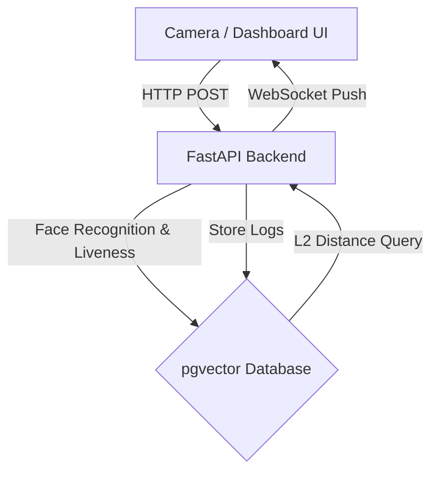

# AI Powered Attendance System

## Overview
A production-ready AI facial recognition attendance platform designed for scalability, modularity, and rapid performance. This system replaces legacy Python webcam scripts with a robust multi-container architecture spanning a **FastAPI** backend, a **PostgreSQL (`pgvector`)** database, and a beautiful **React/Tailwind** dashboard.

## System Architecture



### Tech Stack
- **Frontend**: React (Vite), Tailwind CSS v4, React Router, Recharts, Axios, Lucide React.
- **Backend**: FastAPI, SQLAlchemy, JSON Web Tokens (JWT), WebSockets.
- **Machine Learning**: `face_recognition`, `OpenCV` (Headless), `SciPy` (Liveness EAR Detection).
- **Database**: PostgreSQL with `pgvector` extension for efficient embedding distance searches.
- **DevOps**: Docker, Docker Compose, Nginx.

## Features
- **Real-Time Attendance**: Monitor live events via WebSockets.
- **Vector Search Matching**: Gone are the days of retraining an SVM model! Add new faces dynamically, computing their 128D embeddings and performing rapid `<->` vector matching natively in Postgres.
- **Liveness Detection**: Detects Eye Aspect Ratios (EAR) across facial landmarks to prevent photo spoofing.
- **Scale-Ready**: Multi-camera support. Connect multiple cameras sending async POST arrays of frames to standard REST endpoints.
- **Unknown Faces Engine**: Automatically crops and logs non-matching faces.

---

## Run Without Docker

Follow these steps to run the entire AI Attendance System locally without Docker using a single command.

### 1. Database Requirement
You must have PostgreSQL installed locally alongside the `pgvector` extension.
Ensure your database has a database named `attendance_db` and a user named `postgres` with password `postgres`.
*(Configuration can be overridden in `backend/.env`)*

### 2. Install Dependencies

**Backend:**
```bash
pip install -r backend/requirements.txt
```

**Frontend:**
```bash
cd frontend
npm install
cd ..
```

### 3. Run the System

Execute the unified python launcher script from the root project directory:

```bash
python run_project.py
```

This script will simultaneously boot the **FastAPI backend** (using `uvicorn`) and the **React frontend** (using `npm run dev`), creating an interactive terminal session where both logs output together.

- Frontend → http://localhost:5173
- Backend → http://localhost:8000
- API Docs → http://localhost:8000/docs

## API Documentation

Visit `http://localhost:8000/docs` to test endpoints interactively.
- `POST /api/v1/auth/setup`: Create the initial admin account.
- `POST /api/v1/auth/login`: Issue JWT token.
- `POST /api/v1/attendance/recognize`: Submit an image bytes stream and a camera ID to receive detected faces, confidence scores, and automatically log today's attendance. Supports websocket broadcast on hit.
- `WS /api/v1/attendance/ws`: WebSocket listener for live event stream.

## Testing
Run backend unit tests natively using Pytest structure:
```bash
cd backend
pip install pytest pytest-mock httpx
pytest tests/
```
